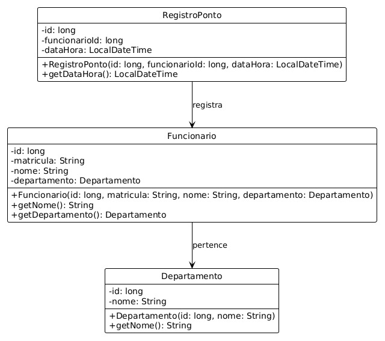
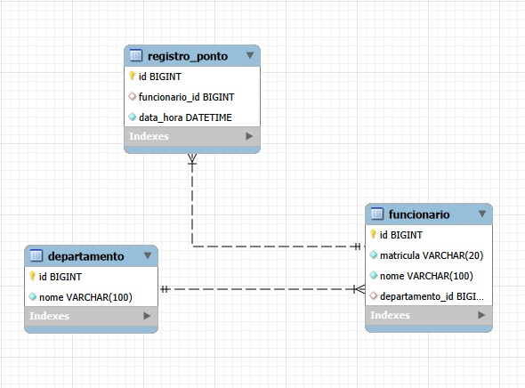

# ⏱️ Sistema de Cartão Ponto

Projeto desenvolvido para a disciplina **Programação Orientada a Objetos II** do curso **Bacharelado em Engenharia de Software** da **Universidade da Região de Joinville (UNIVILLE)**.

---

# 📚 Informações da Disciplina

- **Professor:** Prof. MSc. Leanderson André  
- **Disciplina:** Programação Orientada a Objetos II  
- **Atividade Prática:** Sistema de Cartão Ponto  
- **Tecnologias utilizadas:** Java, JDBC, MySQL

---

# 📊 Diagramas do Projeto

## Diagrama de Classes (UML)



---

## Diagrama MER (Modelo Entidade Relacionamento)



---

# 💾 Banco de Dados

Banco utilizado: **MySQL**

## Script SQL

```sql
USE poo2;

CREATE TABLE departamento (
    id BIGINT AUTO_INCREMENT PRIMARY KEY,
    nome VARCHAR(100) NOT NULL
);

CREATE TABLE funcionario (
    id BIGINT AUTO_INCREMENT PRIMARY KEY,
    matricula VARCHAR(20) NOT NULL,
    nome VARCHAR(100) NOT NULL,
    departamento_id BIGINT,
    FOREIGN KEY (departamento_id) REFERENCES departamento(id)
);

CREATE TABLE registro_ponto (
    id BIGINT AUTO_INCREMENT PRIMARY KEY,
    funcionario_id BIGINT,
    data_hora DATETIME NOT NULL,
    FOREIGN KEY (funcionario_id) REFERENCES funcionario(id)
);

-- Inserindo dados de exemplo
INSERT INTO departamento (nome) VALUES ('Gestão de Pessoas');

INSERT INTO funcionario (matricula, nome, departamento_id)
VALUES ('12345', 'James Gosling', 1);

-- Registros do dia 10/03/2026
INSERT INTO registro_ponto (funcionario_id, data_hora) VALUES
(1, '2026-03-10 08:02:00'),
(1, '2026-03-10 12:01:00'),
(1, '2026-03-10 13:05:00'),
(1, '2026-03-10 17:58:00');
